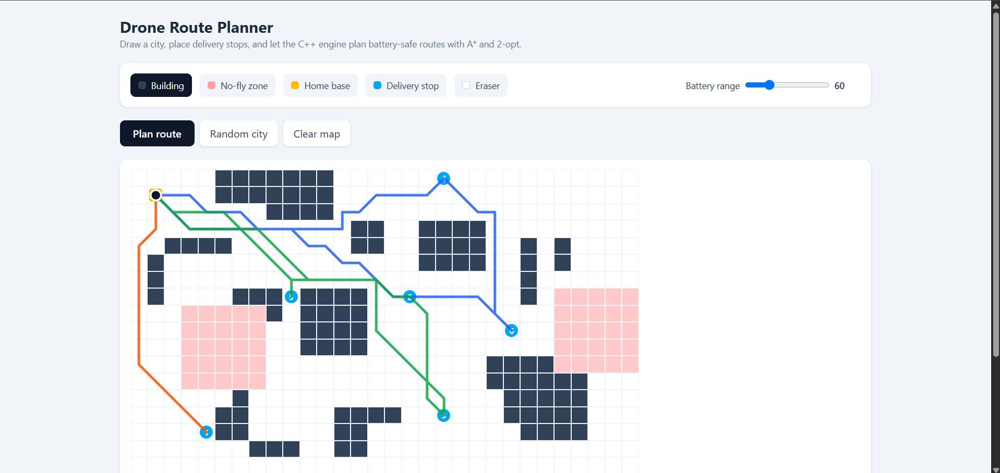

# Drone Route Planner

   

A delivery drone route planner with a high-performance C++ engine. Draw a city with buildings and no-fly zones, place delivery stops, set the drone's battery range, and the engine plans the shortest safe routes, splitting the mission into multiple trips when the battery can't cover everything in one flight.

**🔗 Live demo:** https://YOUR-VERCEL-URL.vercel.app

> The engine runs on a free tier and sleeps when idle, so the first route may take up to a minute while it wakes up.



## Features

- **Interactive map editor:** paint buildings and no-fly zones, place a home base and up to 15 delivery stops, or generate a random city
- **Obstacle-aware pathfinding:** A* search with 8-directional movement and no corner-cutting around obstacles
- **Multi-stop route optimization:** nearest-neighbour construction improved with 2-opt local search
- **Battery-constrained planning:** missions are split into multiple trips so the drone always has enough range to return home and recharge
- **Unreachable stop detection:** stops that are walled off or beyond battery range are flagged instead of breaking the plan
- **Animated playback:** each trip is drawn in its own colour as the drone flies the route

## Performance

Measured on an optimized Release build:

| Benchmark | Average time |
|-----------|--------------|
| A* search, corner to corner on a 100×100 map with 25% obstacles | **0.81 ms** |
| Full 15-stop mission on a 100×100 map (≈120 A* searches + 2-opt + battery splitting) | **15.9 ms** |

## How It Works

1. **Distance table:** A* computes the real flying distance between every pair of points (home and all stops), routing around obstacles.
2. **Feasibility check:** any stop that can't be reached, or can't be reached *and returned from* on a full battery, is marked unreachable.
3. **Initial route:** a nearest-neighbour heuristic builds a visiting order by always flying to the closest unvisited stop.
4. **2-opt optimization:** segments of the route are repeatedly reversed whenever doing so shortens the total distance, removing crossing paths.
5. **Battery splitting:** the optimized order is divided into trips; a new trip starts whenever continuing would leave the drone unable to get home.

## Tech Stack

| Layer | Technology |
|-------|------------|
| Engine | C++20, CMake |
| API | cpp-httplib, nlohmann/json |
| Testing | GoogleTest |
| Frontend | React, Tailwind CSS, SVG animation, Vite |
| Deployment | Docker (multi-stage build), Render, Vercel |

## Project Structure

```
drone-route-planner/
├── engine/
│   ├── src/
│   │   ├── grid.h/.cpp          # Map representation
│   │   ├── pathfinding.h/.cpp   # A* search
│   │   ├── planner.h/.cpp       # Multi-stop planning, 2-opt, battery splitting
│   │   ├── server.cpp           # HTTP API
│   │   ├── benchmark.cpp        # Performance benchmarks
│   │   └── main.cpp             # Command-line demo
│   ├── tests/                   # GoogleTest suite (13 tests)
│   ├── CMakeLists.txt
│   └── Dockerfile
└── frontend/                    # React map editor and route animation
```

## API

`POST /plan`

```json
{
  "width": 30, "height": 18,
  "obstacles": [[8, 0], [8, 1]],
  "noFly": [[13, 3]],
  "home": [1, 1],
  "stops": [[3, 2], [14, 1], [20, 10]],
  "batteryRange": 60
}
```

Returns the trips (stop order, full path, distance), unreachable stops, total distance, and the engine's compute time.

## Running Locally

**Prerequisites:** a C++20 compiler, CMake 3.20+, Ninja, and Node.js 20+.

### Engine

```bash
cd engine
cmake -S . -B build -G Ninja
cmake --build build
./build/server            # API on http://localhost:8080
./build/planner_tests     # run the test suite
```

Benchmarks (use an optimized build):

```bash
cmake -S . -B build-release -G Ninja -DCMAKE_BUILD_TYPE=Release
cmake --build build-release
./build-release/benchmark
```

### Frontend

```bash
cd frontend
npm install
npm run dev               # http://localhost:5173
```